# Markets Plugin for Omarchy

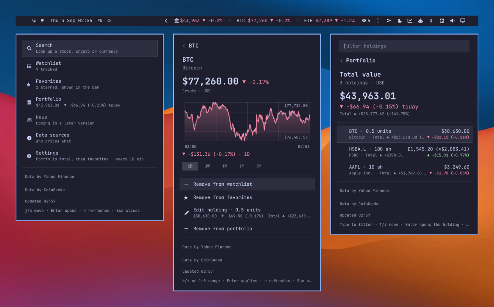

Stocks, crypto and currencies in the [Omarchy](https://omarchy.org) bar. A ticker strip, and a panel with search, watchlist, favorites, portfolio and charts, driven from the keyboard.

This one is basically a port of another app I made a while back Powertoys on Windows - [Markets extension for Command Palette](https://github.com/CostaFot/MarketExtension)

```bash
omarchy plugin add https://github.com/CostaFot/omarchy-markets --enable
```

It is on the [Omarchy plugin marketplace](https://plugins.omarchy.org/plugin.html?id=costafot.markets), reviewed and verified at the listed commit.

Setting it up from a coding agent? Point it at `~/.config/omarchy/plugins/costafot.markets/AGENTS.md`: every setting, IPC verb and helper command, and `bin/markets` answers in JSON.

## In the bar

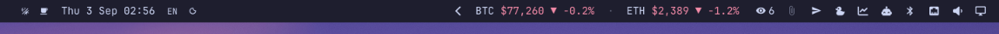
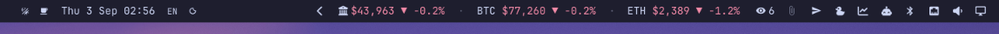
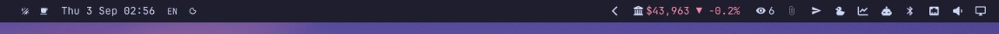

Your money-losing favorites as `BTC $77,260 ▼ -0.2%`, in the theme's green and red. With a portfolio, its total and today's move go first (`strip: "favorites+portfolio"`) or alone (`"portfolio"`).

Out of the box the favorites are BTC, ETH and SOL just for laughs.

When the bar runs out of room the strip drops entries from the end, then collapses to a single glyph; hover it for the full text. 

* Left click opens the panel
* Middle click refreshes.

## The panel

<p>
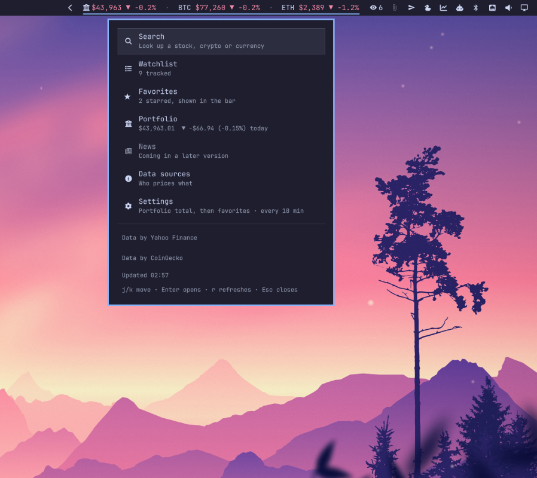
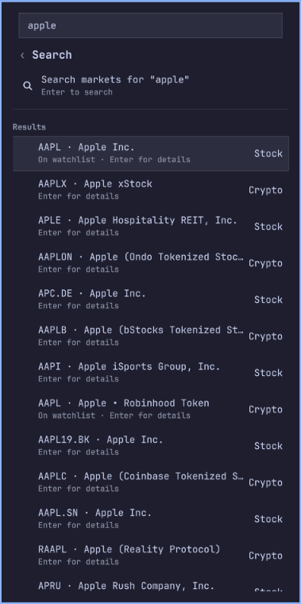
</p>

It opens on a hub. Escape or Backspace walks back a page, Escape on the hub closes. 

The News row is a placeholder for later when i get to it. A cnbc like news ticker might be fun.

**Search** takes a symbol or a name and looks it up when you press Enter. Results come from both providers, tagged Stock, Crypto or Currency, and say whether the row is already on your watchlist.

<p>
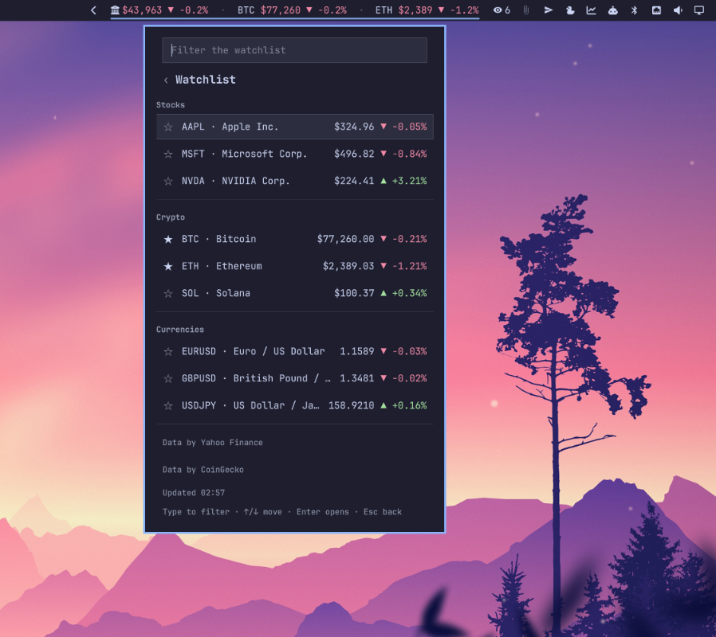
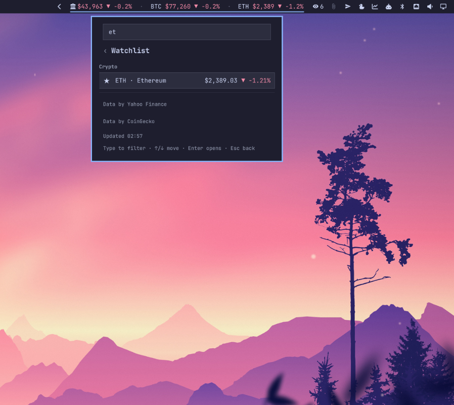
</p>

**Watchlist** and **Favorites** list what you track, grouped and priced. 

* Type to filter by symbol or name
* Tab moves from the box to the list for `j`/`k`
* `/` goes back
* The star on a row toggles the favorite.

<p>
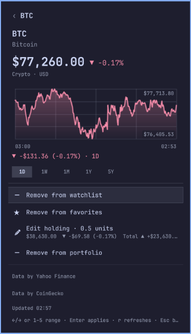
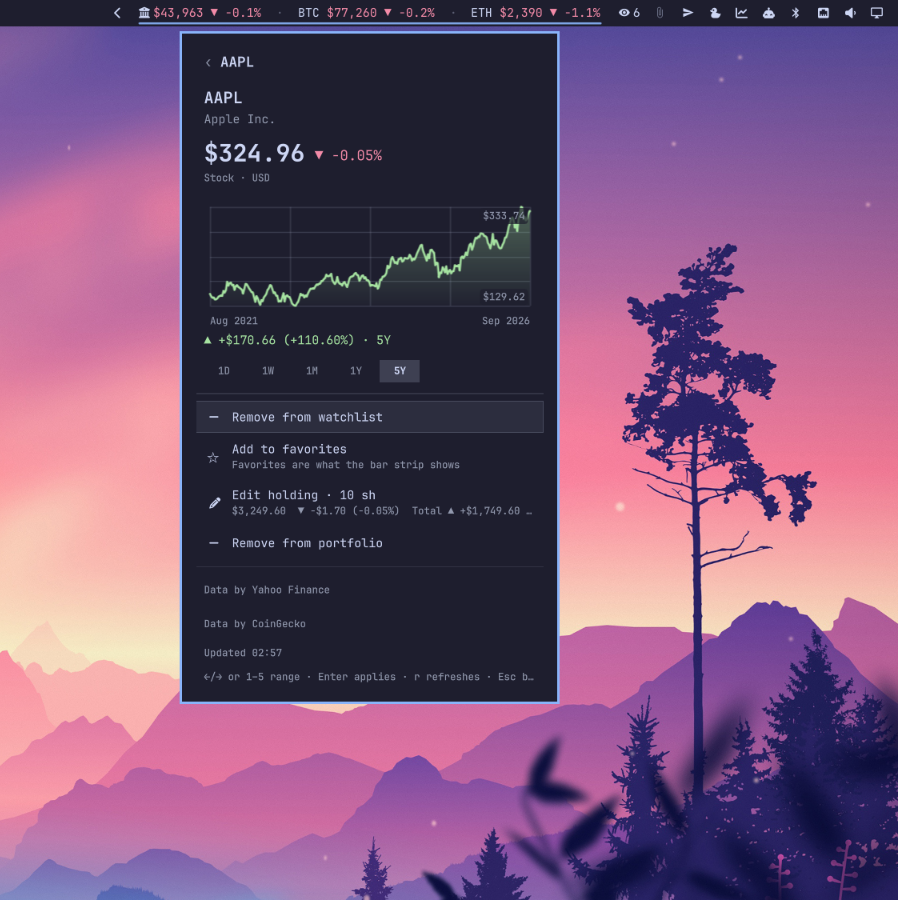
</p>

**An instrument's page**: 
* the price and change
* a chart over 1D, 1W, 1M, 1Y or 5Y with the move across that range under it
* Add or Remove for the watchlist, the favorites and the portfolio

`1`–`5`, `←`/`→` or `h`/`l` switch the range. The day chart of a stock or currency draws yesterday's close as a dashed line.

A symbol you found through search is priced on the way in; Add appears once it has a price.

<p>
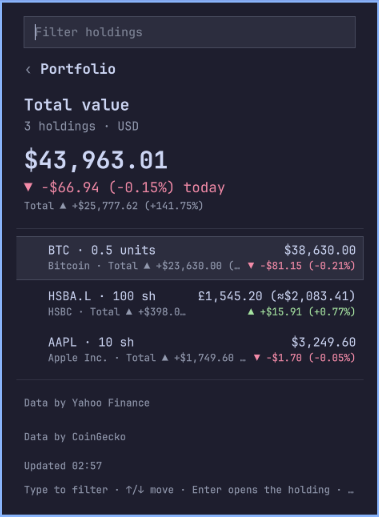
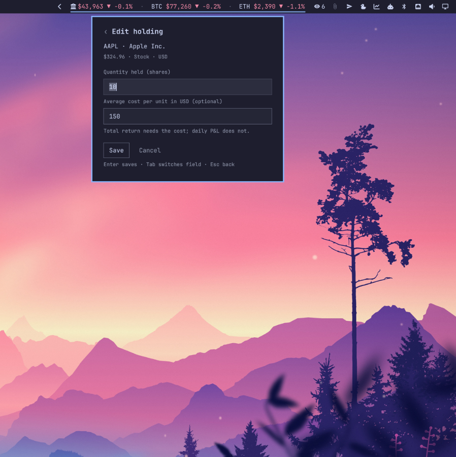
</p>

**Portfolio** pins the totals first: 
* what the holdings are worth
* today's move
* the total return where you recorded what you paid
* how many holdings could not be converted

Under it, one row per holding as `AAPL · 10 sh` with its value, today's P&L and total return.

Holdings in other currencies are converted into your portfolio currency (USD unless you say otherwise) with the ECB's daily rates, shown as `£1,545.20 (≈$2,083.41)`.

The holding form takes how much you hold and, if you like, the average price you paid per unit. Enter saves.

<p>
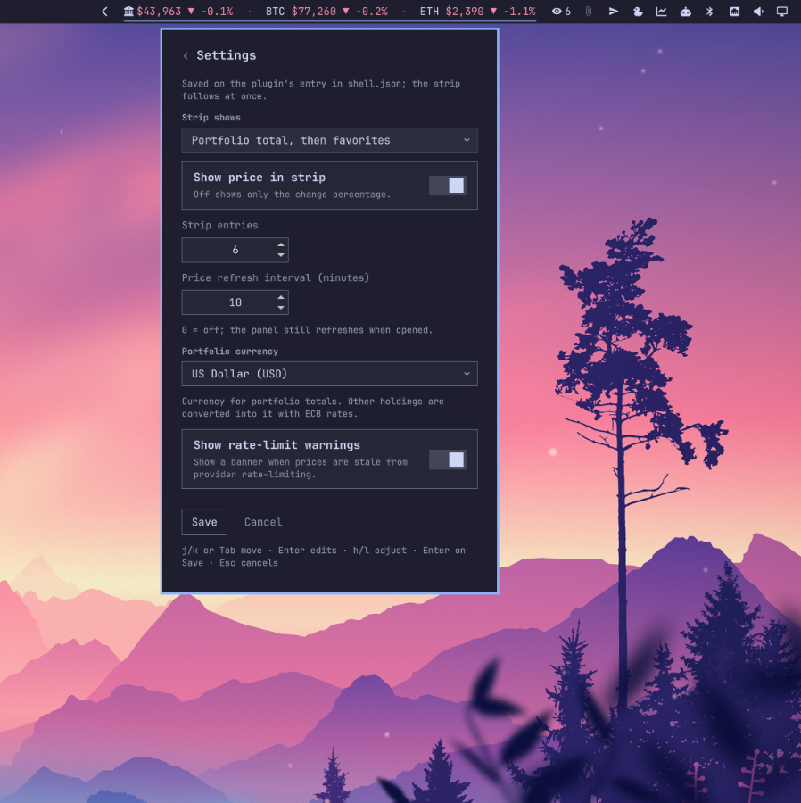
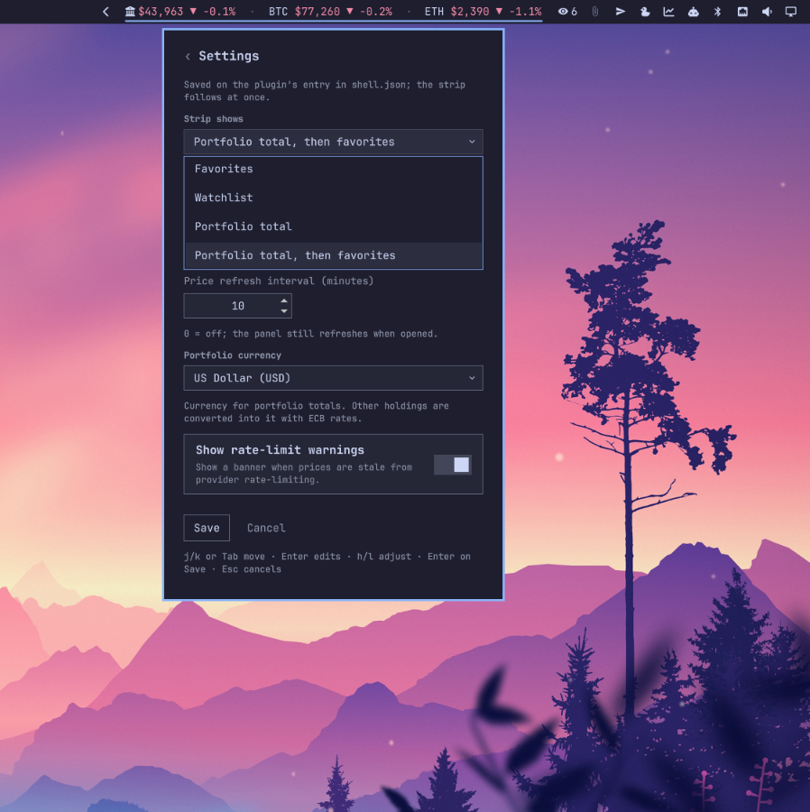
</p>

**Settings** edits the six settings below in the panel.

* Save writes your shell.json entry once and the strip follows without a restart
* Esc cancels

<p>
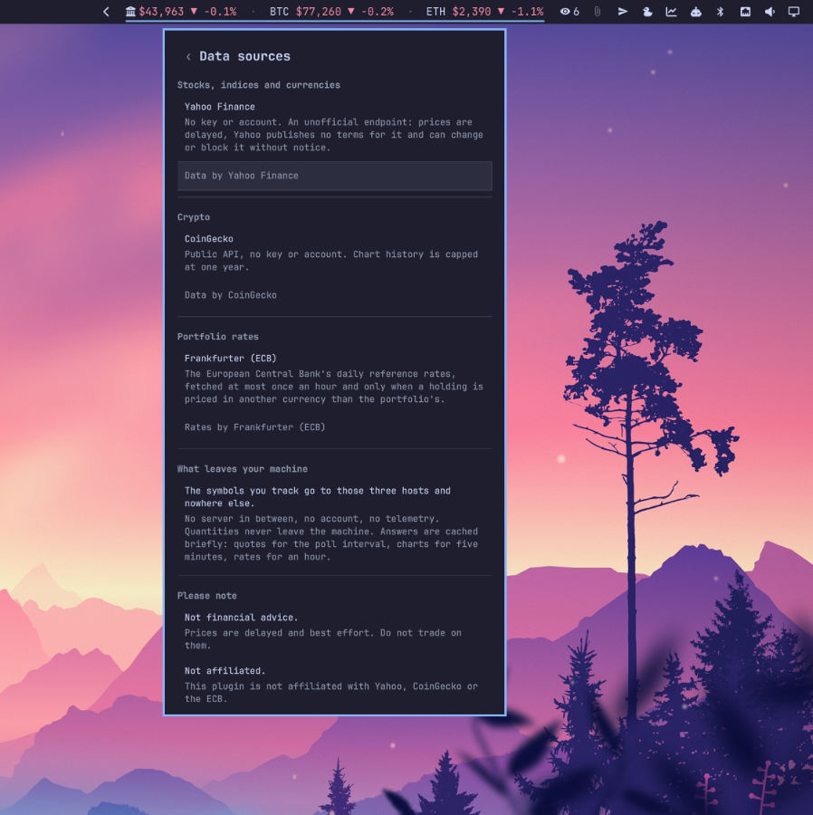
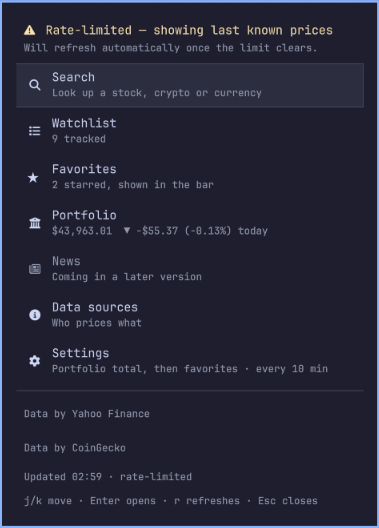
</p>

**Data sources** says who prices what, what leaves your machine, and the disclaimers. Enter on a provider opens its site.

The amber banner means a provider throttled the last fetch.

* the prices on screen are the last known ones
* the bar shows a pause glyph next to them
* the banner stays until a fetch succeeds

| Key | Does |
|---|---|
| `j` / `k`, arrows | Move |
| Enter | Open the row, or apply the action |
| Type | Filter the list, or the search query |
| Tab, `/` | From the box to the list, and back |
| `←` / `→`, `h` / `l`, `1`–`5` | Chart range on an instrument's page |
| `r` | Refresh now |
| Enter, Tab | In the holding form: save, next field |
| Enter, `h` / `l`, Tab | In Settings: edit the control, step it, next control; Enter on Save saves |
| Esc, Backspace | Back; Esc on the hub closes |

From a keybinding or a script:

```bash
omarchy-shell costafot.markets toggle              # also open, close, show, hide
omarchy-shell costafot.markets refresh
omarchy-shell costafot.markets page watchlist      # hub, search, watchlist, favorites, portfolio, sources, settings
omarchy-shell costafot.markets add DOGE crypto     # stock, crypto or currency
omarchy-shell costafot.markets favorite DOGE       # toggles; NEW:crypto for a symbol not yet tracked
omarchy-shell costafot.markets status | jq         # what this bar shows: page, staleness, strip, chart
```

## Settings

The Settings page in the panel edits them; `omarchy bar set costafot.markets stripMax 5 --json` or editing the plugin's entry in `~/.config/omarchy/shell.json` by hand does the same.

| Key | Default | Meaning |
|---|---|---|
| `refreshMinutes` | `10` | Poll interval; `0` turns polling off (the panel still refreshes when opened) |
| `strip` | `"favorites"` | What the strip lists: `favorites`, `watchlist`, `portfolio` (the total and today's move) or `favorites+portfolio` |
| `stripShowPrice` | `true` | Off shows only the change percentage |
| `stripMax` | `6` | Most entries the strip lists before trimming for width |
| `portfolioCurrency` | `"USD"` | Currency for the portfolio totals; other holdings are converted into it |
| `showRateLimitErrors` | `true` | Off hides the amber rate-limit banner in the panel |

## The helper

Everything that touches the network or the disk is `bin/markets`, a Python 3 script with no dependencies. The widget runs it and draws what comes back. Every run has a deadline: each request is capped at 20 seconds and 1 MiB, the whole run at 90 seconds, after which the helper answers with a timeout and the widget shows the last prices it had, paused. A helper that cannot even answer is stopped by the widget ten seconds later.

Try it it yourself:

```bash
bin/markets snapshot | jq '.strip'
bin/markets quotes AAPL HSBA.L EURUSD '^GSPC' | jq -c '.quotes[] | [.symbol, .price_text, .change_text]'
bin/markets search sol | jq '.results[0]'
bin/markets candles AAPL 5Y | jq '.series | {range_change_text, first_label, last_label}'
bin/markets watchlist add TSLA stock | jq '.instruments | length'   # priced once, named by the provider
bin/markets favorite remove TSLA | jq '.strip'
bin/markets portfolio set HSBA.L stock HSBC 100 | jq '.portfolio.totals.value_text'   # quantity, then an optional cost per unit
bin/markets portfolio set BTC crypto Bitcoin 0.5 30000 | jq -c '.portfolio.positions[] | [.holding_text, .value_text, .return_text]'
bin/markets portfolio remove BTC | jq '.held'
```

**Leaves your machine:**

- The crypto symbols you track go to CoinGecko (`api.coingecko.com`) for prices, search results and chart history. No key, no account.
- The stock, index and currency symbols you track go to Yahoo Finance (`query1.finance.yahoo.com`) for the same. No key, no account.
- When the portfolio holds something priced in a currency other than your portfolio currency, the two currency codes go to Frankfurter (`api.frankfurter.dev`) for the ECB's daily rate, at most once an hour. No key, no account. Quantities never leave the machine.

No telemetry.

## The legal bit

Stock, index and currency prices come from an unofficial Yahoo Finance endpoint. It is free and needs no key, but Yahoo publishes no terms for it, does not promise it stays up, and can change or block it without notice.

* Prices are delayed
* If it breaks, the affected rows show a dash and the last known price stays in the panel until it comes back
* Nothing else in the plugin depends on it

This plugin is not affiliated with Yahoo. Do not trade on it.

## Uninstall

```bash
omarchy plugin remove costafot.markets
rm -rf ~/.local/state/omarchy/costafot.markets
```

## FAQ

**Is this financial advice?** No. Prices are delayed and best effort.

**Why is a row showing a dash?** The provider did not answer for it this time: an unknown symbol, a rate limit, or an outage. The last good price is kept and marked stale until the next successful refresh.

**The crypto 5Y chart only shows a year.** CoinGecko's keyless API serves one year of history; the chart says so under the plot. Stocks and currencies get the full five years from Yahoo.

**HSBA.L shows pounds but Yahoo shows pence.** London quotes arrive in pence; the plugin converts them so the row reads `£15.45` like the rest.

**Can I add `EURUSD=X` or `^GSPC`?** Yes. Yahoo's spellings work anywhere a symbol does; a currency pair is stored as `EURUSD`.

**Why does search need Enter?** Both providers rate-limit keyless callers, and a lookup per keystroke would burn that budget on half-typed words. Typing filters the lists you already have for free; only Enter asks the network.

**A holding says "not converted".** Its currency is not one the ECB publishes a rate for, or the rates could not be fetched this hour. The row shows its own money and the total leaves it out until a rate is known.

**The strip is not green and red.** The colours come from the active theme's `colors.toml`: `green`/`red`, else the ANSI `color2`/`color1`, else the theme accent for up and urgent for down.

**Can you add my favorite provider?** I accept large sums of money.
