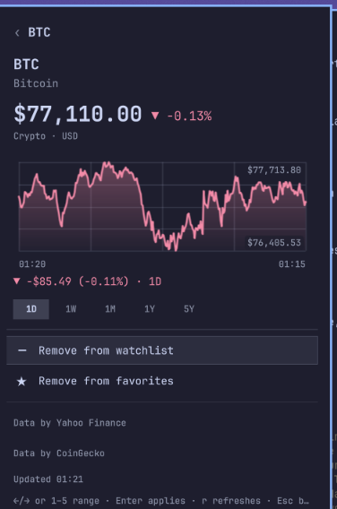

# Markets for Omarchy

Stocks, crypto and currencies in the [Omarchy](https://omarchy.org) bar. A live ticker strip, and a keyboard-driven panel with search, watchlist, favorites, portfolio, news and charts.

A port of the [Markets extension for Command Palette](https://github.com/CostaFot/MarketExtension) on Windows.

> Work in progress. Version 0.5.0 has the bar strip and a panel with search, watchlist, favorites and a page per instrument with a 1D–5Y chart, with crypto priced through CoinGecko and stocks, indices and currencies through Yahoo Finance. No API keys. Portfolio and news come later.

## Install

```bash
omarchy plugin add https://github.com/CostaFot/omarchy-markets --enable
```

## Uninstall

```bash
omarchy plugin remove costafot.markets
rm -rf ~/.local/state/omarchy/costafot.markets
```

## In the bar

The strip lists your favorites as `BTC $77,250 ▲ +0.3%`, the value in your theme's green or red. When the bar runs out of room the strip drops entries from the end, then collapses to a single glyph; hover it for the full text. Left click opens the panel, middle click refreshes.

Out of the box the favorites are BTC, ETH and SOL.

## The panel

It opens on a hub: Search, Watchlist, Favorites, and the pages that are not built yet. Pages stack; Escape or Backspace walks back, Escape on the hub closes.

- **Search** takes a symbol or a name and looks it up when you press Enter, never while you type. Results come from both providers, tagged Stock, Crypto or Currency, and say whether the row is already on your watchlist. Enter on a result opens it.
- **Watchlist** lists what you track grouped into Stocks, Crypto and Currencies, priced. Type to filter by symbol or name; Tab moves from the box to the list for `j`/`k`, `/` goes back. The star on a row toggles the favorite.
- **Favorites** is the same for the starred set, the one the bar strip shows.
- **An instrument's page** shows the price and change, a chart over 1D, 1W, 1M, 1Y or 5Y with the move across that range under it, then Add or Remove for the watchlist and for favorites, labelled for its current state. The day chart of a stock or currency marks yesterday's close with a dashed line. A symbol you found through search is priced on the way in; Add appears once it has a price.



| Key | Does |
|---|---|
| `j` / `k`, arrows | Move |
| Enter | Open the row, or apply the action |
| Type | Filter the list, or the search query |
| Tab, `/` | From the box to the list, and back |
| `←` / `→`, `h` / `l`, `1`–`5` | Chart range on an instrument's page |
| `r` | Refresh now |
| Esc, Backspace | Back; Esc on the hub closes |

From a keybinding or a script:

```bash
omarchy-shell costafot.markets toggle              # also open, close, show, hide
omarchy-shell costafot.markets refresh
omarchy-shell costafot.markets page watchlist      # hub, search, watchlist, favorites
omarchy-shell costafot.markets add DOGE crypto     # stock, crypto or currency
omarchy-shell costafot.markets favorite DOGE       # toggles; NEW:crypto for a symbol not yet tracked
omarchy-shell costafot.markets status | jq         # what this bar shows: page, staleness, strip, chart
```

## Settings

Inline on the plugin's entry in `~/.config/omarchy/shell.json`, or through `omarchy bar set`:

| Key | Default | Meaning |
|---|---|---|
| `refreshMinutes` | `10` | Poll interval; `0` turns polling off (the panel still refreshes when opened) |
| `strip` | `"favorites"` | What the strip lists: `favorites` or `watchlist` |
| `stripShowPrice` | `true` | Off shows only the change percentage |
| `stripMax` | `6` | Most entries the strip lists before trimming for width |
| `showRateLimitErrors` | `true` | Off hides the amber rate-limit banner in the panel |

## The helper

Everything that touches the network or the disk is `bin/markets`, a Python 3 script with no dependencies. The widget runs it and draws what comes back. You can run it yourself:

```bash
bin/markets snapshot | jq '.strip'
bin/markets quotes AAPL HSBA.L EURUSD '^GSPC' | jq -c '.quotes[] | [.symbol, .price_text, .change_text]'
bin/markets search sol | jq '.results[0]'
bin/markets candles AAPL 5Y | jq '.series | {range_change_text, first_label, last_label}'
bin/markets watchlist add TSLA stock | jq '.instruments | length'   # priced once, named by the provider
bin/markets favorite remove TSLA | jq '.strip'
```

**Leaves your machine:**

- The crypto symbols you track go to CoinGecko (`api.coingecko.com`) for prices, search results and chart history. No key, no account.
- The stock, index and currency symbols you track go to Yahoo Finance (`query1.finance.yahoo.com`) for the same. No key, no account.

Nothing else. No telemetry.

## A note about stock data

Stock, index and currency prices come from an unofficial Yahoo Finance endpoint. It is free and needs no key, but Yahoo publishes no terms for it, does not promise it stays up, and can change or block it without notice. Prices are delayed. If it breaks, the affected rows show a dash and the last known price stays in the panel until it comes back; nothing else in the plugin depends on it. This plugin is not affiliated with Yahoo. Do not trade on it.

## FAQ

**Is this financial advice?** No. Prices are delayed and best effort.

**Why is a row showing a dash?** The provider did not answer for it this time: an unknown symbol, a rate limit, or an outage. The last good price is kept and marked stale until the next successful refresh.

**What is the amber banner?** A provider throttled the last fetch. The prices on screen are the last known ones, the bar shows a pause glyph next to them, and the banner stays until a fetch succeeds. `showRateLimitErrors: false` hides it.

**The crypto 5Y chart only shows a year.** CoinGecko's keyless API serves one year of history; the chart says so under the plot. Stocks and currencies get the full five years from Yahoo.

**HSBA.L shows pounds but Yahoo shows pence.** London quotes arrive in pence; the plugin converts them so the row reads `£15.45` like the rest.

**Can I add `EURUSD=X` or `^GSPC`?** Yes. Yahoo's spellings work anywhere a symbol does; a currency pair is stored as `EURUSD`.

**Why does search need Enter?** Both providers rate-limit keyless callers, and a lookup per keystroke would burn that budget on half-typed words. Typing filters the lists you already have for free; only Enter asks the network.

**The strip is not green and red.** The colours come from the active theme's `colors.toml`: `green`/`red`, else the ANSI `color2`/`color1`, else the theme accent for up and urgent for down.
